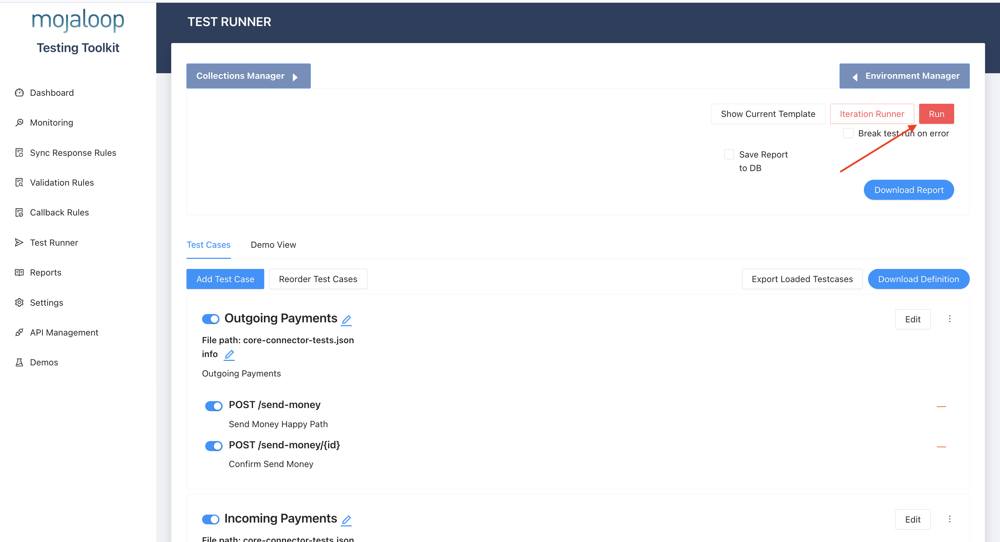

# ML Core Banking System Core Connector Test Harness
A development and testing harness for core connectors that support the P2P cross currency use case in a Mojaloop scheme


# Pre-requisites
Before you go through this test harness documentation, the following are required for you to be able to go through it successfully

- Working knowledge of RESTful APIs
- Docker 

# Overview 
This test harness is intended to provide a core connector testing and development framework. The idea of a core connector came about as a result of the need to have an integration middlewear between the Mojaloop Connector (SDK Scheme Adapter) and a Financial Service Provider (FSP) Core Banking System.

# Developing a Core Connector
To develop a core connector, it is important to understand the different apis that the core connector needs to expose and those it needs to consume to support receipt and initiation of payments in a Mojaloop scheme.

Here is a diagram that illustrates role of a core connector in a typical mojaloop payments scheme


In the illustration, we see the core connector being used as an adaptor between the FSP Core Banking System and the Mojaloop Connector to facilitate payments. 

A core connector is an api server that receives requests from the mojaloop connector and brokers them to your core banking system and vice versa to perform payment operations.

The core connector is supposed to implement and expose two apis for it to be able to effectively support payment operations in a mojaloop scheme.

# Incoming Payments - Payee

Below is an architecture diagram that shows how a core connector supports payee receipt of funds from a mojaloop scheme in this test harness.


In this architecture the core connector is shown as a stateless synchronous api that supports the crediting of funds into an beneficiaries account.

The Mojaloop connector and the switch are simulated using TTK. To support incoming transactions, the core connector should implement the backend api for the Mojaloop connector.

There is also a core banking solution sandbox which represents a financial service provider's core banking solution UAT environment.

When executing test cases on your core connector, for different test cases it is important that a quality assurance personal observes the changing state of account balances to validate that the core connector is indeed functioning as intended for both happy path and non happy paths.

Please find the api schema for the mojaloop connector backend api at this location. The core connector needs to expose an api that will be invoked by the sdk scheme adapter api to receive payments from the mojaloop scheme. The api needs to be in sync with the api definition in this api definition.

```bash
./resources/api-spec/payee.yaml
```

Here is a [link](./resources/api-spec/payee.yaml) to the api schema file

When an inbound payment is received by the  mojaloop connector, it will make requests to your core connector to perform account lookup, quoting and transfers.

The core connector needs to respond to the api calls described in the open api specification for payee.

# Outgoing Payments - Payer
Here is another illustration that shows how the core connector should be used to support out going payments i.e Payments that are initiated from your customers.


In this architecture, the core connector is shown as a stateless synchronous api that brokers initiation of payments through the mojaloop connector.

To initiate payments to a beneficiary whose account is held in another financial service provider, the core connector would need to make requests to the outbound api of the mojaloop connector.

As you develop your connector, it is important that your core connector conforms to this scheme to inititate payment requests through the mojaloop connector.

Please find the api schema for the mojaloop connector outgoing api at the this location

```bash
./resources/api-spec/ml-connector-bound.yml
```

Here is a [link](/resources/api-spec/ml-connector-bound.yml) to the api schema file

We have also designed a send money RESTful api which your core banking solution can use to send transfer requests to your core connector. 

This send money api is supposed to be implemented by your core connector and exposed as a server on a port so that your core banking solution can use it to initiate send money requests as well as merchant payment requets.

Please find the send money api schema at this location

```bash
./resources/api-spec/payer.yaml
```

Here is a [link](/resources/api-spec/payer.yaml) to the api schema file
Here is an architecture to illustrate how all the different apis line up in the integration setup.


# Core Connector Networking

The core connector needs to expose services on two ports, one port listening for requests from your core banking solution and the other listening for requests from the mojaloop connector


To support testing, the core connector should expose these two ports.

- `3003` for receiving requests from the Mojaloop connector
- `3004` for receiving requests from your Core banking solution

When developing and testing your core connector, make all requests to this base url http://localhost:4040/sdk-out-v2-1/  after running the test harness to initiate outbound payments through the mojaloop connector's outbound api

Refer to the [Setup](#setup) section to learn more about how to run the test harness.

Use it as the base url for all paths detailed in the api schema for outgoing payments payee api.

You can set it as an environment variable and access it within your core connector source code. 

# Setup

Once you have developed the core connector, it will need to be tested to verify that it responds accordingly to all happy paths and exception cases.

To test your core connector, you will need to package it as a docker image using a [Dockerfile](https://docs.docker.com/reference/dockerfile/)

Build your core connector docker image and tag it with the name in the command. You can build like so.

```bash
docker build -t cbs-core-connector:local . 
```
When you run the test harness using docker compose, it will be able to pick up the built docker image and run it as part of the test stack.

To run the test harness use this command to clone this repository. 

```bash
git clone https://github.com/mojaloop/CbsCoreConnectorTestHarness.git
```
After cloning this repository, navigate into the directory to set up the tests.

```bash
cd CbsCoreConnectorTestHarness
```
Copy the contents of the environment file you created if any to the .env.example file in this folder


Run this command to bootstrap the test harness on your local machine.

```bash
docker compose up 
```
You could also choose to run it in detached mode by adding the `-d` option.

```bash
docker compose up -d
```

After bootstraping the test harness, you are ready to start running tests against your core connector.


# Running Tests
To run the tests, you will need to open the TTK UI in your web browser.
TTK is deployed as part of the test harness.

Follow this link to open the TTK Ui. http://localhost:6060


Once you open this link, you will be brought to this interface as shown in this screenshot


Click on Test Runner 


In the right hand upper corner click the Run button to execute test cases against your core connector.



After executing the tests, you will see the test results which will show how many tests passed or failed.

# Conclusion

This test harness is intended to support the development and testing of core banking solution core connectors for a mojaloop.

Note that it is important to implement the api schemas correctly because the api schemas are the ones against which test  case assertions will be executed.

